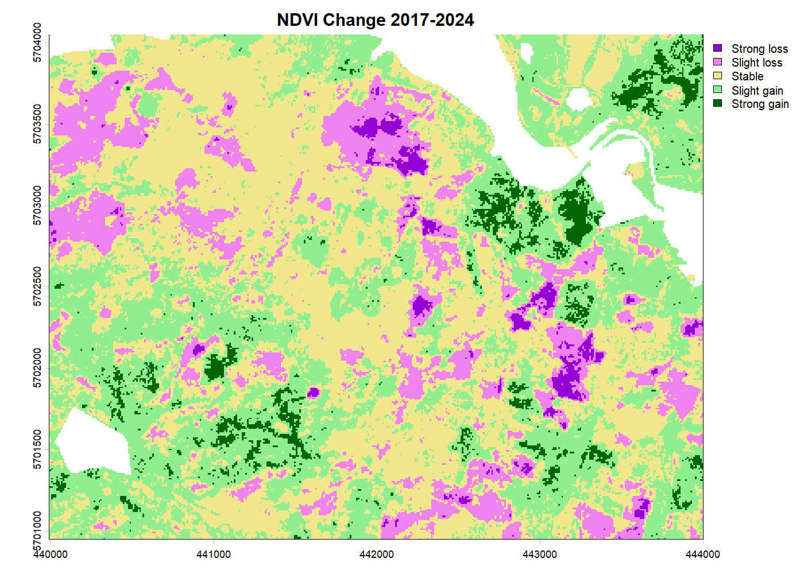
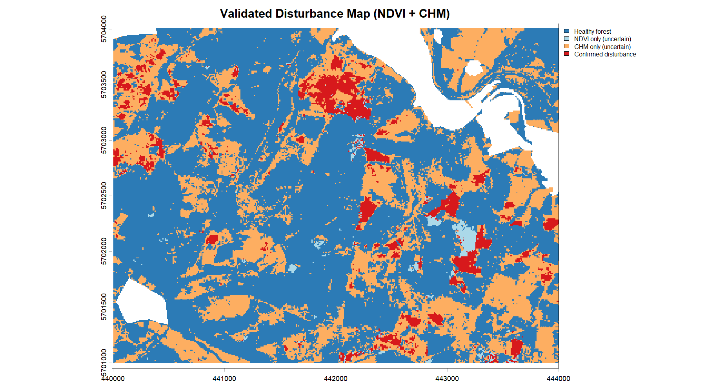
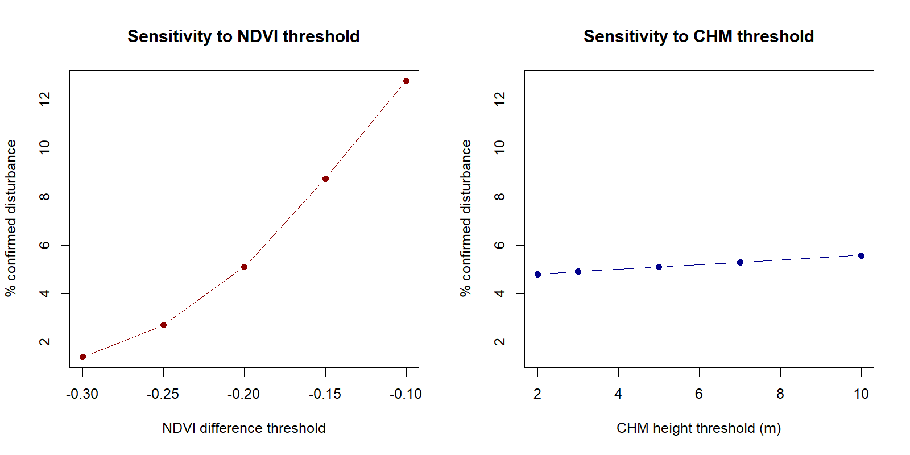
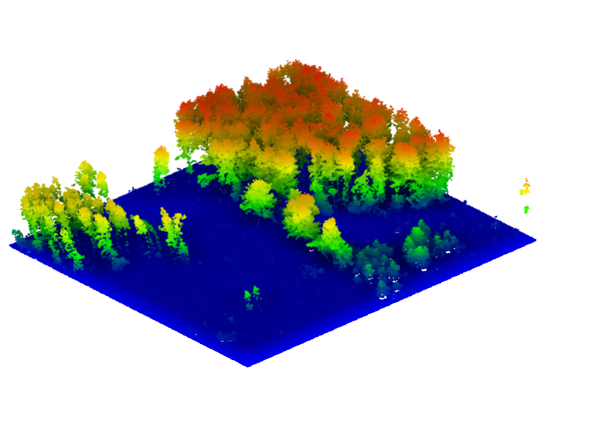

# Forest Disturbance Mapping Using ALS and Sentinel-2 Time Series

LiDAR Course: Final Project

## 1. Short description of the topic

Mapping forest disturbance around Möhnesee (Kreis Soest, Sauerland, NRW) by
combining Airborne Laser Scanning (ALS) data with a Sentinel-2 NDVI time
series (2017–2024).

**Research question:** Where in the study area around Möhnesee has the
spruce forest changed structurally/spectrally since 2017  and how
reliably can vegetation change detected via a Sentinel-2 time series be
structurally confirmed using current ALS canopy height data?

The thematic background is the large-scale spruce die-off across NRW since
2018 (storm "Friederike", followed by bark beetle infestation). Whether the
specific study area itself was affected is what this analysis investigates.
It is not assumed as a given (see "Sources" below).

**Study area:**
- Möhnesee, Kreis Soest, Sauerland, NRW
- Bounding box (ETRS89/UTM32): `440861,5701167;443294,5703135`
- ca. 12 km² (ALS tiles), ca. 11.2 km² after excluding water/settlement

## 2. Data used

| Source | Description | Access |
|---|---|---|
| ALS point cloud | 3D-Messdaten Laserscanning (LAZ), 12 tiles | [Geoportal.NRW](https://www.geoportal.nrw/) – bounding box as above |
| Sentinel-2 | NDVI time series 2017–2024, yearly median | [Copernicus Data Space Ecosystem](https://dataspace.copernicus.eu/) via openEO |
| OpenStreetMap | Water/settlement polygons for masking | [osmdata](https://github.com/ropensci/osmdata) R package |

The raw ALS data (~1.83 GB) are **not** part of this repository (see
`.gitignore`) and can be re-downloaded via the map extract linked above.

### Known limitations
- **Only one ALS acquisition, inconsistent flight date:** 10 of 12 tiles
  are from 14.03.2024, the two north-western tiles from 25.11.2020. A true
  before/after CHM difference is not possible via the open NRW portal
  (older data only available on request). ALS therefore serves as a
  **spatial reference** to the current state, not as a separate time-series
  layer.
- **Thresholds not data-driven:** see sensitivity analysis under point 4.
- **No area-specific external reference** for storm/beetle damage. Only
  state-wide context data (Wald und Holz NRW), see sources below.

## 3. Code

All scripts are in `code/`:

| Script | Description |
|---|---|
| `als.R` | ALS processing with lidR: reading (LAScatalog), noise filter, ground classification, height normalization, Canopy Height Model (pitfree algorithm, smoothed), Area-Based Metrics (`.stdmetrics_z`) |
| `sentinel_2.R` | Sentinel-2 NDVI time series via openEO/Copernicus Data Space: load datacube, compute NDVI, yearly aggregation, batch job download |
| `disturbance_comparison.R` | Spatial alignment (reprojection/resampling), water/settlement masking (OSM), NDVI difference map, validated disturbance map (NDVI + CHM combined), sensitivity analysis, area statistics |
| `cloud_compare.R` | Locates the strongest disturbance edge (largest connected "Confirmed disturbance" patch bordering healthy forest), clips the corresponding ALS point cloud extract for visualization in CloudCompare |

**Tools/packages:** [lidR](https://r-lidar.github.io/lidRbook/), [terra](https://rspatial.github.io/terra/), [sf](https://r-spatial.github.io/sf/), [openeo](https://openeo.org/), [osmdata](https://github.com/ropensci/osmdata), [CloudCompare](https://www.cloudcompare.org/) (visualization)

---

## 4. Results and documentation

### Methodological workflow
1. ALS pipeline (lidR) → CHM (1m) + Area-Based Metrics (10m)
2. Sentinel-2 NDVI time series (openEO) → yearly raster maps 2017–2024
3. Reprojection/resampling: CHM aligned to Sentinel-2 grid (10m, EPSG:32632)
4. Masking of water/settlement areas (OSM)
5. Validated disturbance map: NDVI difference 2024−2017 < -0.2 **and**
   CHM < 5m → "Confirmed disturbance"
6. Sensitivity analysis of both thresholds
7. Area statistics + CloudCompare detail view at the strongest disturbance edge

### Key result: area statistics

| Category | Area (ha) | Share |
|---|---|---|
| Healthy forest | 707.89 | 63.39% |
| NDVI only (uncertain) | 10.70 | 0.96% |
| CHM only (uncertain) | 339.29 | 30.38% |
| **Confirmed disturbance** | **58.82** | **5.27%** |

### Sensitivity analysis
- NDVI threshold: highly sensitive (1.4%–12.8% confirmed area across -0.30
  to -0.10), continuous rather than abrupt change → suggests a gradual
  (beetle-typical) rather than sudden (storm-typical) disturbance dynamic
- CHM threshold: robust (4.8%–5.6% across 2–10m) → the structural ALS
  signal provides a more stable indicator than the spectral Sentinel-2
  signal

### Map products (in `results/`)

*Classified NDVI change map 2017–2024*

*Combined, validated disturbance map (NDVI + CHM)*

*Threshold sensitivity analysis*

*Rendered CloudCompare screenshot of the disturbance edge extract (height-colored, SSAO shading), showing the structural contrast between healthy canopy and the disturbed area at ground level*

Other files in `results/` (not directly renderable on GitHub):
- `chm_moehnesee.tif`, `chm_smoothed_moehnesee.tif:` canopy height model
- `aba_metrics_moehnesee.tif:` area-based height metrics (36 layers)
- `disturbance_area_statistics.csv:` area statistics
- `showcase_disturbance_edge.laz:` ALS point cloud extract used for the CloudCompare screenshot above

## Sources (storm/beetle damage context, NRW)
- Alsleben, J., Pflugmacher, D., Rehwaldt, R., Okujeni, A., & Hostert, P. (2026). "Mapping tree dieback using Sentinel-2 time series and generalized regression-based unmixing models reveals species-specific patterns across Germany." Remote Sensing of Environment, 342, 115464.
https://doi.org/10.1016/j.rse.2026.115464
https://www.sciencedirect.com/science/article/pii/S0034425726002348
- Forstpraxis.de, "5 Jahre Waldschäden: Wie ein Sturm die Fichte zerstörte": https://www.forstpraxis.de/5-jahre-waldschaeden-wie-ein-sturm-die-fichte-zerstoerte-21829
- Ministerium für Landwirtschaft und Verbraucherschutz NRW, "Waldzustandsbericht 2025" (2025), incl. Copernicus-based spruce damage monitoring: https://www.mlv.nrw.de/wp-content/uploads/2026/01/Waldzustandsbericht-NRW_2025_lang_ba-1.pdf

## Author
[Sofia Zaruchas]